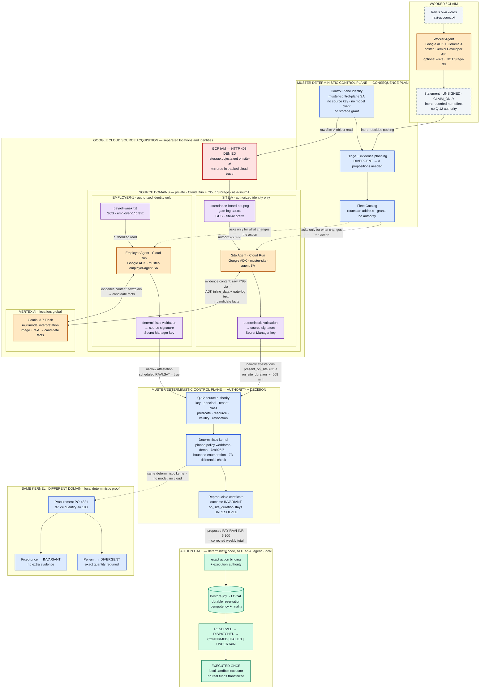

# MUSTER Architecture

> **When records disagree, MUSTER proves only what matters — and acts only on what can be proved.**

MUSTER pairs Gemini's ability to interpret messy, multimodal enterprise
evidence with the deterministic authority, policy, and execution controls that
consequential enterprise actions require. The separation of responsibilities:

```
Gemini interprets.
Sources attest.
Policy determines consequences.
Deterministic controls authorize execution.
```

This document describes the system as implemented in this repository. Where a
capability was demonstrated in a verified Google Cloud execution, it says so.
Where a capability runs only locally, it says that too.

---

## 1. Why MUSTER Exists

An enterprise agent almost never owns the facts it needs. A payroll question
needs the employer's roster, the site's access control, and sometimes the
worker's own account of what happened. Those live in different departments,
under different owners, behind different security boundaries, with different
rules about who may read them.

Three properties make this hard:

- **The evidence is unstructured, and it disagrees.** Payroll is a text export
  saying Saturday was rostered and unpaid. The site's record is a badge log and
  a photograph of an attendance board. The worker has his own account. Reading
  material in that many shapes is exactly what a multimodal model is good at.
- **Ownership is real and it is enforced.** Copying everything into one place so
  a single process can read it is the largest possible privacy footprint for
  what is often a very small question — and in a real enterprise, IAM will
  simply refuse.
- **The action has consequences.** A payment must be authorized against
  institutional authority, evaluated under a pinned policy, and reproducible
  afterwards. Those are properties of a control plane, not of an interpreter.

MUSTER joins the two capabilities. Gemini reads the messy material where it
lives, under the identity authorized to see it, and turns it into structured
candidate facts. Deterministic controls then establish source authority, apply
pinned policy, and govern execution.

It also inverts the usual collection order. MUSTER first asks *which uncertainty
could actually change what we do*, and gathers evidence only for that.
Frequently a disagreement turns out not to matter at all — every value
consistent with the evidence produces the same action — and in that case MUSTER
never asks anyone to resolve it.

---

## 2. System Architecture



**The privacy claim, stated precisely:**

> Raw evidence never reaches the MUSTER Control Plane. Source-local agents
> retrieve it under their authorized identity and invoke Gemini for
> interpretation; only validated, signed narrow attestations enter MUSTER.

Cloud Run services and Cloud Storage are in `asia-south1`. Vertex AI inference
runs at the `global` location. These are two separate configuration values, and
the deployment ships them as different values on purpose.

**Legend**

| Colour | Meaning |
|---|---|
| Amber | Interpretation — Gemma or Gemini via Google ADK |
| Violet | Source authority — source-controlled material and signed attestations |
| Blue | Deterministic control — hinge, Q-12, kernel, policy, certificate |
| Red | Google Cloud security boundary — enforced by GCP IAM |
| Green | Execution boundary — the Action Gate |

---

## 3. The Ravi Workforce Case

Ravi was rostered for six days and paid for five. He says he worked Saturday
too. The payroll export records the Saturday row as rostered, unpaid, with the
note *"no attendance record received from site."*

The relevant facts:

| Fact | Value | Source |
|---|---|---|
| Daily rate | INR 850 | Employer, already established |
| `scheduled(RAVI, SAT)` | `true` | Employer Agent, `HR_PAYROLL_SYSTEM`, RECORD |
| `present_on_site(RAVI, SAT)` | `true` | Site Agent, `SITE_ACCESS_CONTROL`, OBSERVATION |
| `on_site_duration(RAVI, SAT)` | `>= 508 minutes` (closed lower bound) | Site Agent, OBSERVATION |
| Policy threshold | `>= 240 minutes` | Pinned bundle `workforce-demo` |

**MUSTER never establishes Ravi's exact duration.** The site attested a lower
bound, not a value. Because 508 already exceeds the 240-minute threshold, every
admissible world — every duration from 508 minutes upward — produces the same
consequential action. The kernel therefore returns `INVARIANT` while
`on_site_duration(RAVI, SAT)` and `shift_payable_under_policy(RAVI, SAT)` remain
listed as unresolved. The exact number of minutes is never established, never
disclosed, and never needed.

The outcome, in the only wording the system supports:

> Saturday is payable under the pinned policy on authorized attested grounds.

The proposed action is:

```
PAY  recipient = RAVI  amount = INR 5,100
```

**INR 5,100 is the corrected weekly total**, not payment for Saturday. The
decision program sums the daily rate over the six working days on which the
shift is payable: `6 × INR 850 = INR 5,100`, carried under the basis code
`WEEKLY_SHIFT_TOTAL`. Ravi was paid INR 4,250 for five days; Saturday becoming
payable moves the week's total, and the action names the total.

Ravi's own message is present in the case throughout. The Worker Agent turns it
into a `StatementRecord` with an explicit unsigned marker and `CLAIM_ONLY`
authority. The `SelfServingClaimIsInert` rule records it as a non-effect with
reason `ADVERSE_INTEREST_ABSENT`. It never reaches Q-12, because Q-12 judges
attestations and a claim is not one. In this case the claim happens to be
correct, and it contributes nothing either way.

---

## 4. Google AI Models for Interpretation, Deterministic Controls for Consequences

### Model responsibilities

In this integration, **model tier follows trust tier** as a composition choice,
not as a general security theorem:

- **Worker claim intake:** Gemma 4 (`gemma-4-26b-a4b-it`) through Google's
  hosted Gemini Developer API, only in the optional local `--live` hero. The
  model sees the synthetic human narrative and may call `record_claim`; the
  existing validator can produce only an unsigned `StatementRecord` with no
  institutional authority, attestation, signing capability, Q-12 path, or
  decision power.
- **Institutional evidence:** Gemini 3.7 Flash through Vertex AI for Employer
  and Site source agents. Candidates are validated, signed by the source, and
  judged by Q-12.
- **Consequences and execution:** no model. Deterministic MUSTER controls own
  authority, pinned policy, consequence evaluation, certificate reproduction,
  and execution eligibility.

The default local hero remains deterministic and offline. The Worker Gemma
integration does not change the verified Stage-90 cloud execution: Stage-90
used Gemini 3.7 Flash on Vertex AI for Employer and Site and replayed, rather
than reran, the Worker claim.

Site-A's evidence is a photograph of an attendance board and a comma-separated
gate log — a picture and a table, about the same shift, in two different shapes.
Gemini reads both together in a single turn and returns structured candidate
facts. Without a multimodal interpretation layer, this application would need
format-specific OCR, layout heuristics, and a bespoke parser per evidence type.
Gemini makes support for new evidence formats largely a configuration and
integration task rather than requiring bespoke extraction code for every
format. New source domains may still require adapters, permissions, schemas,
deterministic validation, and institutional authority setup.

> The authorized source-local agent invokes Gemini 3.7 Flash on Vertex AI
> (location: global) to interpret source material into candidate facts;
> deterministic code validates them and the source signs the attestation.

What each live agent sends to its configured hosted model:

| Agent | Material sent | Model delivery |
|---|---|---|
| Worker Agent | synthetic `ravi-account.txt` narrative | Gemma 4 through the Gemini Developer API, optional local `--live` only |
| Employer Agent | `payroll-week.txt` | `text/plain`, through the local read tool |
| Site Agent | `attendance-board-sat.png` | raw PNG bytes via ADK `inline_data` |
| Site Agent | `gate-log-sat.txt` | UTF-8 text, through the local read tool |

Gemini returns **candidate facts** — a target label, a relation, a value, an
observation timestamp, and a local basis reference. That is a genuinely
structured output over genuinely unstructured input, and it is the step nothing
else in this system could perform.

Candidate facts then enter a deterministic validation pipeline, which checks:

- the target was actually offered to this turn, and appears at most once;
- the relation is one the target permits;
- the value parses under the pinned sort and lies inside the pinned domain;
- the observation timestamp is parseable and inside the configured horizon;
- the validity window contains the case instant.

The source then signs a narrow attestation with a key held in Secret Manager,
and that signed attestation is what crosses into MUSTER.

**The division of responsibility**

| Model interpretation owns | Deterministic controls own |
|---|---|
| Turning the Worker narrative into a candidate claim label and value | Validating it into an unsigned, inert statement or rejecting it |
| Reading text and images together | Validating candidates against the pinned schema |
| Turning unstructured material into candidate facts | Establishing institutional source authority (Q-12) |
| Adapting to new evidence formats without new parsers | Evaluating pinned policy over established facts |
| | Reproducing the result and its certificate |
| | Governing execution at the Action Gate |

Both halves are necessary. Interpretation without deterministic controls gives
an answer with no account of the authority it rests on; deterministic controls
without interpretation cannot read a photograph of a whiteboard at all.

The boundary is drawn where responsibility changes hands. Signing is a source's
act, authority is the registry's, policy is the bundle's, and execution is the
Gate's — so a candidate fact becomes consequential only by passing through each
of those in turn. A model version is recorded as telemetry: it says which model
produced a candidate, and the candidate is judged the same way regardless.
Replay never re-issues a model call, which is what lets a decided case be
re-derived byte-for-byte at any later date.

The same agent runtimes also run against scripted deterministic interpreters,
with no branch anywhere between the two paths, and both reach the same answer.
That is a property of the pipeline rather than a comment on the model: once a
candidate has survived validation, authority, and pinned policy, the consequence
is determined by the evidence and the policy.

---

## 5. Source Isolation and GCP IAM

Isolation here is an IAM policy, not an application-level convention.

There is **one** Cloud Storage bucket, `muster-site-evidence-<project>`, in
`asia-south1`, holding two prefixes:

```
site-a/        attendance-board-sat.png, gate-log-sat.txt, manifest.json
employer-1/    payroll-week.txt, manifest.json
```

Access is granted by **IAM-conditioned bindings**, one prefix per service
account, using `resource.name.startsWith(...)` on the object path. The
consequences below were verified against the live project. The reproducible
public verification path is [`infra/scripts/70-verify-iam.sh`](infra/scripts/70-verify-iam.sh),
and the tracked sanitized cloud case artifact at
[`packages/muster-ui/public/cases/ravi-cloud-execution.json`](packages/muster-ui/public/cases/ravi-cloud-execution.json)
mirrors the observed Control Plane HTTP 403 without publishing raw evidence:

| Principal | `site-a/gate-log-sat.txt` | Site signing key |
|---|---|---|
| `muster-control-plane@…` | **HTTP 403 DENIED** | **PERMISSION_DENIED** |
| `muster-site-agent@…` | allowed (527 octets read) | allowed (251 octets read) |
| `muster-employer-agent@…` | **HTTP 403 DENIED** | — |

Isolation is mutual: the employer agent has no more access to Site-A's material
than the control plane does. Nothing in MUSTER withholds the material from the
control plane — it is simply not reachable from there, and the cloud run
demonstrates this by trying and being refused before it acquires anything.

Deployed Google Cloud components:

- **Cloud Run services** — `muster-site-agent`, `muster-employer-agent`
  (`--ingress=internal`)
- **Cloud Run job** — `muster-control-plane-hero`
- **Service accounts** — `muster-control-plane`, `muster-site-agent`,
  `muster-employer-agent`, `muster-build`
- **Cloud Storage** — the private evidence bucket described above
- **Secret Manager** — `muster-site-signing-key`, `muster-employer-signing-key`,
  each accessible by exactly one service account
- **Vertex AI** — Gemini 3.7 Flash

Model calls carry no key: the Vertex call is authenticated by the service
identity attached to the Cloud Run revision, so there is nothing to rotate,
nothing to leak, and nothing to check into a repository.

Network identity and source authority are also kept apart. A Google-signed
identity token answers *which service made this call*; Q-12 answers *whether
this key may attest this predicate*. Neither implies the other in either
direction.

---

## 6. Q-12 — Signed Is Not Authorized

A signature answers one question: *which key produced these octets.* That is
authenticity, and authenticity is not authority. A perfectly valid signature
from a real, unrevoked key can still be entirely inadmissible.

This is an institutional question, not a question about how the fact was read.
A payroll figure typed by a clerk, extracted by a regex, or interpreted by
Gemini reaches Q-12 as the same kind of claim, and is judged by the same
clauses: whether the source that signed it holds authority to say it.

Check Q-12 answers the question that decides admissibility:

> Was **this key**, as **this institutional principal**, in **this tenant**,
> holding **this source class**, permitted to assert **this predicate** over
> **this resource**, under **this authorization-policy version**, at **this
> instant**, and not revoked?

The clauses run in a fixed order, (a) through (f), and the first failure is the
reported one — so two conforming implementations return the *same* rejection,
not merely *a* rejection. Each clause has its own typed failure; there is no
generic `AUTHORITY_FAILED`, because an operator debugging a legitimate agent
must be able to tell "wrong site" from "wrong class".

Every input except the claimed source class comes from state the claimant could
not choose: the authority snapshot is resolved by digest from the revision's
pinned authorization context and its publisher signature is verified before any
clause runs; the resource coordinates come from the pinned predicate schema; the
instant is the revision's `as_of`. A receipt that fails Q-12 is refused **before
its octets reach the store**, so an unauthorized attestation never becomes
transcript membership.

**The Fleet Catalog and authority are separate systems.** Discovery reads a
signed catalog snapshot and returns *a candidate address*. It takes no authority
snapshot and no revocation snapshot, and it imports neither — an import-linter
contract (`authority-never-consults-the-catalog`) enforces this at build time.
Deleting the catalog would change which agent gets asked and would change no
admission decision at all.

> The Fleet Catalog routes. It does not grant trust.

---

## 7. Deterministic Kernel and Hinge Analysis

Before acquiring anything, MUSTER asks whether the uncertainty it already has
can change what it would do.

- If every admissible world produces the same consequential action →
  **`INVARIANT`**. Resolving the uncertainty is pointless; MUSTER does not ask.
- If different admissible worlds produce different actions → **`DIVERGENT`**.
  MUSTER emits an evidence request naming exactly the propositions whose
  resolution could move the answer.

The evidence plan is a **set**, never a per-variable relevance flag. Under
correlation every member of a group can be individually droppable while the
group is jointly required — the workforce case has exactly that shape — and a
design that shipped a boolean per variable would report "nothing matters" and
authorize the wrong payment. Where the kernel can prove the set is irredundant
it carries a deletion witness per member: a pair of admissible worlds agreeing
on the rest of the support and disagreeing on the action. Without a witness for
every member the result is labelled sufficient rather than minimal, and never
described as minimal.

In the Ravi case this produced three requirements — `scheduled`,
`present_on_site`, `on_site_duration` — each pinned to a permitted source class,
which is what the Fleet Catalog then routed.

This is what makes evidence collection consequence-sensitive: MUSTER asks a
source for something only when the answer could move the outcome, which is both
a privacy property and an efficiency one.

The hero and procurement paths run the reference **bounded enumeration** backend
(`BoundedEnumerationBackend`). A Z3 backend also exists and is used as a
**differential test oracle**: the two backends are cross-checked against each
other across property, exhaustive, and scenario suites. MUSTER is not
"Z3-powered"; Z3 is how the deciding backend is kept honest.

Every backend answer, decoder failure, and budget exhaustion maps to exactly one
public outcome. There is no path that falls through, and none that turns a
missing answer into a permissive one — an unknown answer is `Indeterminate`, not
`Invariant`.

---

## 8. Reproducibility

MUSTER artifacts are content-addressed under a canonical codec with exactly one
octet string per value. `decode` rejects every non-canonical encoding it could
otherwise accept — a non-minimal integer, an unordered set, a duplicated member
— so `encode(decode(octets)) == octets` holds for everything it admits, and a
digest identifies a *value* rather than a spelling of one. Unknown tags,
truncated streams, and trailing octets are typed rejections; nothing is skipped,
defaulted, or repaired.

A case revision is **derived, never authored**. `rebuild` is a pure function of
its inputs against an immutable store, with a fixed pass order: admissibility
interprets the transcript, the pinned bundle's entailment rules materialise over
those facts, and structural domain bounds are restated last for variables still
open. Nothing reads a clock or an environment variable.

The analysis certificate binds the revision, the pinned bundle manifest, the
kernel record, the planning record, and the solver fingerprint. It is read back,
not recomputed — it records what a particular solver, at a particular version,
under a particular budget, answered about one revision. The verified cloud
execution re-derived it and reported `certificate_reproduced: true` with
determinism class `REPRODUCIBLE`.

**What is not replayed is the model.** A Gemini call is never re-executed during
rebuild, and model output is not deterministic. What replays is everything
downstream of validation: the signed attestation, its admission through Q-12,
the derivation, and the analysis. That is the property that makes model
nondeterminism irrelevant to the answer.

---

## 9. Action Gate

Interpretation and side-effect execution are separated on purpose. The Action
Gate is deterministic code holding one responsibility: turning an authorized
decision into exactly one act, and recording durably that it happened.

Authorization is bound to an **exact action value**, never to an abstract action
kind. The `ActionIntent` carries, in canonical form:

```
tenant_id · case_id · revision_number · revision_digest
certificate_digest · kernel_result_digest
bundle_manifest_digest · authorization_context_digest
gate_id · executor_id
action_schema_digest · action_digest
action (kind, recipient, typed amount)
```

There is no intermediate value that authorizes an action kind and fills its
consequential fields later. The SHA-256 of those canonical octets is a 32-octet
`ExecutionKey`, which is simultaneously the durable reservation identity and the
executor's idempotency key. Change the amount by one paisa and it is a different
key, a different reservation, and a different authorization.

**Lifecycle**

```
RESERVED ──► DISPATCHED ──► CONFIRMED | FAILED | UNCERTAIN
```

Only these transitions are legal. Finality is explicit:

| State | Finality |
|---|---|
| `RESERVED` | `DEFINITELY_NOT_EXECUTED` |
| `FAILED` | `DEFINITELY_NOT_EXECUTED` |
| `CONFIRMED` | `DEFINITELY_EXECUTED` |
| `DISPATCHED`, `UNCERTAIN` | `OUTCOME_UNKNOWN` |

**The irreversible boundary is `DISPATCHED`.** While a row is `RESERVED`,
nothing has been sent and a contender may safely continue. Crossing into
`DISPATCHED` is a durable compare-and-set, and only its winner calls the
executor. Any later call — a retry, a second browser tab, a concurrent process —
reads the durable row and returns it. **No state after `RESERVED` is ever
automatically redispatched.** A row left `DISPATCHED` or `UNCERTAIN` has an
unknown outcome and requires reconciliation against the executor; the Gate will
not guess. If the executor raises after possibly having accepted, the outcome is
recorded as `UNCERTAIN` rather than as a failure.

**Recovering a `RESERVED` execution.** `RESERVED` is not a stuck state and needs
no separate recovery API. It is the state machine's proof that dispatch has
*not* occurred: nothing was sent, so there is nothing to reason about.
`execute()` already carries a durable reservation forward. A later process
presenting the same `ActionIntent` re-derives the same `ExecutionKey`, finds the
existing row and attempts the `RESERVED → DISPATCHED` conditional update —
and that conditional update *is* the single-winner ownership mechanism. Exactly
one caller wins it and reaches the executor; every other caller reads the
durable row. U5 added a real process-death proof of this behaviour: a child
interpreter reserves, commits and exits through `os._exit` before any dispatch,
and a fresh process recovers the same row to `CONFIRMED` with exactly one
dispatch and one external transfer. U5 did **not** introduce a new recovery API
for `RESERVED`.

The read paths are the deliberate exception: `read_authorized_execution`
refuses a reservation with `RESERVED_WITHOUT_DISPATCH`, and
`reconcile_execution` refuses it with `NOTHING_TO_RECONCILE`. Neither reaches
the executor, and the reasoning is the same in both — see *The idempotency read*
below.

**Reconciling `DISPATCHED` and `UNCERTAIN`.** These are fundamentally different
from `RESERVED`, because an external effect may already have happened. MUSTER
does not retry them and does not guess: it asks the executor.

`ActionGate.reconcile_execution` takes an authenticated caller, a tenant and an
`ExecutionLookup`, applies the same authority and binding checks as the
idempotency read, and — for a row in `DISPATCHED` or `UNCERTAIN` — calls
`inspect()` on the executor. Reconciliation **never redispatches**: there is no
code path from it to `dispatch()`, and an adversarial test asserts that
syntactically over the service's own AST.

`inspect()` is observational. It reads the executor's durable record of the
effect the executor owns, and answers:

| Answer | Meaning | Reconciled state |
|---|---|---|
| `ExecutedAs(external_reference)` | the executor holds the effect | `CONFIRMED` |
| `NotExecuted(code, detail)` | the executor holds no such effect | `FAILED` |
| `StillUnknown(code, detail)` | the executor cannot say | `UNCERTAIN` |

An executor that does not implement `ReconcilableExecutor` is refused with
`EXECUTOR_NOT_RECONCILABLE` rather than being interpreted, and an exception
raised inside `inspect()` is `StillUnknown`, never a failure.

The reconciliation transitions are exactly:

```
DISPATCHED ──► CONFIRMED | FAILED | UNCERTAIN
UNCERTAIN  ──► CONFIRMED | FAILED
```

`RESERVED` is not reconciled through this API: it answers
`NOTHING_TO_RECONCILE` and never reaches the executor. `CONFIRMED` and `FAILED`
remain final — reconciling one returns the existing record unchanged. A
`StillUnknown` answer over a row that is *already* `UNCERTAIN` does not rewrite
it merely to produce a fresh timestamp.

Each reconciled row carries its own provenance. `reconciled_from` records the
state the compare-and-swap actually moved away from, and `reconciled_at` when it
did. A `DISPATCHED` reconciliation establishes a normal `finalized_at` if the
dying process never did; an `UNCERTAIN` reconciliation preserves the original
`finalized_at`. Database `CHECK` constraints refuse a lone half of the pair, a
`reconciled_from` outside `DISPATCHED`/`UNCERTAIN`, an illegal source/target
pair, and a `reconciled_at` before finalization. The Gate read model projects
both fields verbatim, so a reader can distinguish an outcome the dispatching
process established itself from one established by later observation — without
that provenance ever changing the state or the finality.

**The executor trust boundary.** The executor is authoritative for the external
effect it owns, and it is the only authority MUSTER consults about that effect.
MUSTER never infers the result from elapsed time, from process death, from a
missing finalize, or from anything held in local memory. There is no lease, no
timeout, no ownership heartbeat and no background reconciler anywhere in the
Gate.

**The crash window this closes.** The dangerous interleaving is:

```
the external system accepts the action
   ──► the MUSTER process dies before it can finalize
   ──► the durable Gate row is left DISPATCHED
   ──► a later process calls reconcile_execution
   ──► inspect() finds the executor's record of that same effect
   ──► the existing row reconciles to CONFIRMED
   ──► zero redispatches, one external effect
```

The row is the same row and the key is the same key: reconciliation never opens
a second execution, a second identity or a second table.

**Concurrency.** Many reconcilers may `inspect()` at once, because inspection is
read-only and changes nothing. Exactly one durable compare-and-swap changes the
row; PostgreSQL serializes the contenders on it, and every loser is handed the
winner's record rather than a conflict. Eight independently constructed
deployments — separate `SqlDatabase`, gate, authority and executor objects,
sharing only the DSN — race this in the suite and return one identical
confirmation, with zero dispatches and an unchanged external world. No lease,
heartbeat, timeout or automatic retry participates.

An exact full repeat uses this same path, not a second execution mechanism.
`reserve` attempts the same PostgreSQL insert with `ON CONFLICT DO NOTHING`,
reads the winner, and verifies every binding with `binding_mismatches`. For a
previously confirmed intent the service returns that record before the dispatch
claim. A fresh executor therefore observes zero dispatch calls, while the
execution key, external reference, intent octets and all lifecycle timestamps
remain those of the first call. A unique proposal constraint also prevents the
same authorized revision from being rebound to another Gate or executor under a
second key.

The head of the case is held across validation and reservation, so a proposal
cannot become stale between the replay and the durable insert. A case that moved
is refused with `CASE_MOVED` rather than executed against an old certificate.

**The idempotency read is addressed by `ExecutionKey`, not by the case.** A
retry presents the key and, optionally, the case it believes it is asking
about; the store answers by primary key or answers `ABSENT`. Nothing on that
path reads the case head, calls a case command or touches the executor — so a
confirmed execution stays addressable for as long as its row exists, however
far the case has advanced since. An identity derived from the current head
would have made a payment that already happened unfindable the moment one more
transcript entry was appended.

The read still authenticates its caller, still requires an exact grant for the
action kind the *stored* intent names, still refuses a row another Gate
authorized, and still refuses `RESERVED` — a reservation that never crossed the
executor boundary is unfinished work, and finishing it is an action.

> The current browser demo uses **local PostgreSQL** and a **sandbox executor**.
> No real funds are transferred, and no payment rail exists in this repository.
> The sandbox executor mints deterministic synthetic transaction references.

**The durable sandbox rail.** Reconciliation is only meaningful if the
executor's world outlives the MUSTER process, so the reconcilable executor used
by the suite keeps its protocol and effect records in a separate `sandbox_rail`
schema, written on connections and transactions entirely outside
`action_gate.execution`. Dispatch commits an `ATTEMPTED` marker before starting
the transfer transaction. `ATTEMPTED` without a visible transfer is unknown;
a transfer row is executed; and `NotExecuted` requires durable
`DEFINITIVELY_NOT_EXECUTED` evidence. An inspection that finds no marker first
seals the key with that negative evidence, whose primary key prevents a later
dispatch from starting. That separation and ordering are the point: the rail
survives the death of the Gate process independently of MUSTER's custody, which
is what makes a real process-death proof possible at all.

> The sandbox rail is a **simulated external system**, not infrastructure. It
> transfers **no real funds**. It is **not a payment provider and not a payment
> rail**; it holds no account and no credential for one, and it must not be
> presented as production financial infrastructure. It exists so that "the
> external world already accepted this" is something a test can make durably
> true and then observe from a different process.

The Action Gate was **not** part of the verified Stage-90 cloud execution. That
run stops at the analysis by design: no gate, nothing authorized, nothing
settled, and that remains the default for every Stage-90 run.

> **Cloud Action Gate support is implemented, not deployed/verified.** A
> deliberate `HERO_GATE_MODE=CLOUD_SQL_ACTION_GATE_SANDBOX` runs the same
> deterministic Gate over Cloud SQL custody against the same synthetic sandbox
> executor. The earlier retry mode names an execution key and only reads the
> recorded lifecycle. The repeat mode accepts no key: a second execution of the
> same digest-pinned job reconstructs the stable synthetic officer, authority
> publisher, catalog publisher and fixture-source identities, replays the full
> hero case,
> re-derives the identical intent and calls `ActionGate.execute()` again. The
> deployed agents' source keys remain the real configured source keys; derived
> fixture-source keys are confined to the synthetic hero population and are
> never minted under deployed references. The repeat re-applies
> authority/catalog publication and case admission, so it is not a pure read,
> but an exact confirmed execution row is returned without redispatch. This is
> covered locally across PostgreSQL and
> separate OS processes and has not been run against Google Cloud, so nothing in
> this document claims a verified cloud execution of it. The mode is refused
> under ephemeral custody and runs its own case, so the verified analysis-only
> case stays untouched.

The local convergence path is `demo/hero.py --postgres --gate`: the ordinary
worked case runs over PostgreSQL, the same Action Gate reaches `CONFIRMED`, and
an exact call from a fresh Gate/executor pair returns that durable lifecycle
with zero dispatches. The default local hero remains analysis-only unless the
explicit `--gate` flag is present.

---

## 10. Cross-Domain Proof — Procurement

The same kernel, the same admissibility rules, the same hinge analysis — a
different domain and a different policy.

Purchase order **PO-4821**, supplier SUPPLIER-ORION. The supplier declares 100
units; warehouse receiving counts 97 as a closed lower bound; the PO caps the
order at 100. So the admissible range is:

```
97 <= delivered_quantity <= 100
```

**Fixed-price contract** — acceptable if quantity ≥ 97, payment INR 63,000:

| Quantity | Action |
|---|---|
| 97 | PAY INR 63,000 |
| 98 | PAY INR 63,000 |
| 99 | PAY INR 63,000 |
| 100 | PAY INR 63,000 |

Outcome: **`INVARIANT`**. One reachable action. Additional evidence:
`NONE_REQUIRED`, reason `ACTION_INVARIANT`. The exact quantity is irrelevant to
this action, so MUSTER does not ask the warehouse to recount.

**Per-unit contract** — INR 630 per unit:

| Quantity | Action |
|---|---|
| 97 | PAY INR 61,110 |
| 98 | PAY INR 61,740 |
| 99 | PAY INR 62,370 |
| 100 | PAY INR 63,000 |

Outcome: **`DIVERGENT`**. Four reachable actions. Additional evidence:
`REQUIRED`, reason `ACTION_SENSITIVE_UNCERTAINTY`, hinge `delivered_quantity`,
permitted source class `WAREHOUSE_RECEIVING`. The same uncertainty now changes
the action, so MUSTER asks for authoritative warehouse evidence.

Same kernel. Different policy. Different evidence requirement. The policy
changed; the code did not.

This is a **local deterministic proof**, derived from the pinned procurement
bundle. No model and no cloud execution is used for it.

---

## 11. Verified Cloud Execution vs Local Demo

Verified execution: `muster-control-plane-hero-htkpt`, captured in the tracked
sanitized artifact
[`packages/muster-ui/public/cases/ravi-cloud-execution.json`](packages/muster-ui/public/cases/ravi-cloud-execution.json).

| Component | Verified Stage-90 cloud execution | Local demo / replay | Notes |
|---|---|---|---|
| Employer Agent | Yes — Cloud Run, real Gemini call | Yes | Attested `scheduled(RAVI,SAT)`, key `key-hr-payroll-cloud-1` |
| Site Agent | Yes — Cloud Run, real Gemini call | Yes | Attested `present_on_site` + `on_site_duration`, key `key-site-a-cloud-1` |
| Worker Agent | **No — not rerun** | Yes | Deterministic by default; optional `--live` uses hosted Gemma 4 through the Gemini Developer API. No deployment or authority |
| Gemma inference | **No** | Optional (`--live`) | `gemma-4-26b-a4b-it`, Developer backend, unsigned claim intake only |
| Gemini inference | Yes — Employer + Site | Optional (`--live`) | `gemini-3.7-flash`, Vertex AI, location `global` |
| GCP IAM 403 | Yes — real denial recorded | — | `muster-control-plane` denied `storage.objects.get` on `site-a/` |
| Q-12 | Yes — passed on all three attestations | Yes | Same admission function on both paths |
| Kernel result | Yes — `INVARIANT` | Yes — `INVARIANT` | Identical outcome, identical unresolved set |
| Certificate rebuild | Yes — `certificate_reproduced: true` | Yes | Determinism class `REPRODUCIBLE` |
| Action Gate | **No — not executed in any verified run** | Yes | The captured cloud trace records `NOT_EXECUTED`. Cloud Gate support is implemented and not deployed/verified |
| PostgreSQL | **Yes — private Cloud SQL** | Yes — local Docker | Durable custody verified in execution `-tsjds`; a second execution read the identical identity back |
| Durable semantic revalidation | **No — not run against live Cloud SQL** | Yes — local PostgreSQL, independent OS processes | Stored construction, publications and entries are reverified; Q-12 and replay reproduce the certificate with zero writes and dispatches |
| Procurement | **No — not run in cloud** | Yes | Local deterministic proof, no model |
| UI | **No — not deployed** | Yes — local Vite | Reads committed cloud artifacts plus the local Gate API |
| Executor reconciliation | **No — not run against Cloud Run, Cloud SQL or a deployed rail** | Yes — local PostgreSQL, real process death | `DISPATCHED`/`UNCERTAIN` rows reconciled by inspecting the executor, with zero redispatch. The two proofs differ: **local** is literal process death; the **live** sequence, implemented and not yet run, is a durably *unknown outcome* — the simulation commits its transfer, loses the answer, and a later execution confirms the `UNCERTAIN` row. Cloud Run process death is not claimed |
| Durable sandbox rail | **No — not deployed** | Yes — local PostgreSQL schema | Simulated external world. Not a payment provider or payment rail |
| Payment | — | Sandbox only | No payment rail. No real funds transferred |

The demo and the acceptance suite call the same functions. There is no branch
that a demo takes and a deployment does not, no answer written down in advance,
and no path that skips authorization.

---

## 12. Google Cloud Deployment

| | |
|---|---|
| Project | `muster-agentic-2026-9177` |
| Cloud Run / Cloud Storage region | `asia-south1` |
| Vertex AI model | `gemini-3.7-flash` |
| Vertex AI location | `global` |
| Cloud Run services | `muster-site-agent`, `muster-employer-agent` |
| Cloud Run job | `muster-control-plane-hero` |
| Verified execution | `muster-control-plane-hero-htkpt` |

**Services used:** Cloud Run, Cloud Storage, IAM, Secret Manager, Vertex AI.
Artifact Registry and Cloud Build support the image pipeline.

The region and the model location are configured separately and ship as
different values. The Cloud Run services and the sources' material are regional;
the model is called at the `global` endpoint because that is where the shipped
model is served. Setting the Vertex location to `asia-south1` restores full
co-location and is correct for any model served regionally there.

**PostgreSQL is a verified Google Cloud resource in this project**, and also
runs in a local Docker container behind the browser demo. Durable custody was
provisioned and exercised end to end; the provenance below is enough to audit it.

| | |
|---|---|
| Project | `muster-agentic-2026-9177` |
| Region | `asia-south1` |
| Instance | `muster-control-plane-db`, PostgreSQL 16, private IP only, no public IPv4, `sslMode=ENCRYPTED_ONLY` |
| Source commit | `6fa34c0025cfde69386aa73d0467402507cf38ac` |
| Control-plane image | `sha256:d4139a5f4c48b81357263f3863c91ad2e590a784690752b80cf0b785796b6c31` |
| Stage-90 execution | `muster-control-plane-hero-tsjds` |
| Persistence verification | `muster-s90-verify-temp-zzs9w` |

The instance's private address is deliberately not written down here — no
internal address appears anywhere in this repository's documentation, and an
authorized auditor reads it from `gcloud sql instances describe`. Passwords, DSN
payloads and key material are in Secret Manager and appear nowhere in the tree.

Two roles, neither holding `cloudsqlsuperuser`: `muster_migrator` owns the
database and is the only identity that performs DDL, and `muster_runtime`
connects with `SELECT`/`INSERT` on the immutable tables, `UPDATE` on the three
that compare-and-set, and `SELECT` on the migration ledger — no `DELETE`, no
`TRUNCATE`, no `CREATE`, no ownership. PostgreSQL refuses each of those to the
runtime role with SQLSTATE `42501`.

**What this verifies, precisely.** Execution `-tsjds` wrote the case; execution
`-zzs9w`, a separate Cloud Run execution in a separate process, read back an
identical revision digest, certificate digest, construction digest,
authorization-context digest, transcript count and transcript-membership digest.
Those two recorded cloud executions establish **persistence across process
termination** and nothing more: the second execution re-verified nothing. U4
now composes process-stable synthetic officer, publisher and fixture-source
trust and proves semantic revalidation locally with real PostgreSQL and
independent OS processes. That local proof does not retroactively turn the
earlier Cloud Run read into revalidation, and U4 has not been run against live
Cloud SQL or a deployed Cloud Run job.

Deployment is scripted end to end in `infra/scripts/` (`00-enable-apis` through
`99-teardown`), and the IAM posture is verified by `70-verify-iam.sh`, whose
output is committed as evidence.

---

## 13. Responsibility and Trust Boundaries

Each layer establishes something specific and passes the rest on. The middle
columns say what a layer settles and what it deliberately leaves for the next
one — which is how a candidate fact becomes a consequential action by degrees
rather than in one step.

| Boundary | What this layer establishes | What it leaves to the next layer | Enforcement |
|---|---|---|---|
| Worker claim interpretation (Gemma, optional live) | A candidate label and value from Ravi's narrative | Whether the candidate validates; whether it is true; whether anything follows | Closed Worker brief and `record_claim`; output is unsigned and never a justification variant |
| Worker claim | That Ravi said it, and what he said | Whether it is true; whether anything follows from it | `SelfServingClaimIsInert` — recorded non-effect, never a justification variant |
| Institutional interpretation (Gemini) | Structured candidate facts from source text and images | Whether each candidate is well-formed and in scope | Multimodal reading via ADK; candidates carry target, relation, value, timestamp, basis |
| Deterministic validation | That a candidate matches the offered target, pinned sort, domain, horizon, and validity window | Whether the source may say it at all | Closed target brief; pinned predicate schema |
| Source signature | Which key produced the octets | Whether that key held authority | ECDSA (P-256) verification against the source keyring |
| Q-12 | Institutional authority: key, principal, tenant, class, predicate, resource, validity, revocation | What the established facts imply | Clauses (a)–(f) in fixed order; refusal before storage |
| Deterministic kernel | The consequence under pinned policy, and whether uncertainty could change it | Whether and how the action is carried out | Pure functions, canonical codec, reproducible certificate |
| Action Gate | That the exact bound `ActionIntent` was executed at most once, and its durable outcome | — | Durable compare-and-set on a 32-octet execution key; head hold; legal-transition table |
| GCP IAM source boundary | Which identity may read which source material | What the authorized reader does with it | Prefix-conditioned IAM bindings; real HTTP 403 |

---

## 14. What MUSTER Does NOT Claim

Stated plainly, because a reader who catches an overclaim has found a real
defect rather than a quibble.

MUSTER does **not**:

1. prove that Ravi objectively worked — it decides that Saturday is payable
   under the pinned policy on authorized attested grounds;
2. establish his exact working duration — `on_site_duration` remains
   permanently unresolved and undisclosed;
3. route authority through the interpretation layer — candidate facts are
   validated and signed by the source before Q-12 evaluates authority;
4. make a real payment — the executor is a synthetic sandbox and no payment rail
   exists in this repository;
5. run the Action Gate in the verified cloud execution — the Stage-90 run stops
   at the analysis, and the cloud Gate mode is implemented, not
   deployed/verified;
6. claim a live cloud run *resumes* or *re-validates* a case across executions —
   U4 proves that property locally over PostgreSQL and independent OS processes,
   while the recorded Cloud SQL executions establish persistence of durable
   identity only;
7. claim procurement ran in the cloud — it is a local deterministic proof;
8. claim the Worker Agent reran during Stage-90 — the committed ADK path exists
   but was not deployed, and the claim was replayed from the fixture;
9. claim all evidence remained in `asia-south1` — evidence content, including
   raw PNG bytes, is sent to Vertex AI at the `global` location by the
   authorized source agent;
10. claim the UI is cloud-deployed — it is a local Vite application;
11. claim executor reconciliation has been live-verified — it is proved locally
    over PostgreSQL and real process death, and has **not** been run on Cloud
    Run, against Cloud SQL reconciliation, against a deployed sandbox rail, in a
    deployed runtime, or against any real payment provider.

The system is a hackathon implementation over synthetic fixtures. It is not
represented as hardened for production use.

---

## 15. Why This Architecture Matters

The usual shape of an agent workflow is:

```
gather everything → interpret it → act on the result
```

That works until the action has consequences. Gathering everything maximises the
privacy footprint for what is often a small question — and in an enterprise,
least-privilege IAM will refuse it outright. And an answer arrives with no
record of whose authority it rests on or whether it can be reproduced next
quarter when someone asks why the payment was made.

MUSTER reorders it:

```
determine which uncertainty could change the consequence
        ↓
retrieve only that evidence, through authorized sources
        ↓
Gemini interprets it, invoked by the source-local agent
        ↓
deterministic authority and pinned policy establish the consequence
        ↓
execute through a separately controlled boundary, exactly once
```

Each stage contributes something the others cannot. Hinge analysis narrows the
question to what is consequential. Source-local acquisition keeps material with
its owner and satisfies real IAM. Gemini makes support for new evidence formats
largely a configuration and integration task rather than requiring bespoke
extraction code for every format. New source domains may still require adapters,
permissions, schemas, deterministic validation, and institutional authority
setup. Q-12 supplies that institutional authority. The deterministic kernel
makes the consequence reproducible under pinned policy. The Action Gate makes
execution auditable and exactly once.

The Ravi case is the whole argument in one line: Gemini read a photograph of an
attendance board and a badge log and produced structured facts; a sandbox
payment was then authorized and executed exactly once on attested grounds —
while the number at the centre of the dispute was never established, never
disclosed, and never needed.

> **MUSTER combines Gemini's ability to understand messy enterprise evidence
> with deterministic authority, policy, and execution controls — so AI can
> participate in consequential enterprise workflows that remain auditable and
> reproducible.**
