# MUSTER Architecture

> **When records disagree, MUSTER proves only what matters — and acts only on what can be proved.**

The trust rule the whole system is built around:

```
Models may interpret.
Sources may attest.
Policy may entail.
Only deterministic code may decide and authorize.
```

This document describes the system as implemented in this repository. Where a
capability was demonstrated in a verified Google Cloud execution, it says so.
Where a capability runs only locally, it says that too.

---

## 1. Why MUSTER Exists

An enterprise agent almost never owns the facts it needs. A payroll question
needs the employer's roster, the site's access control, and sometimes the
worker's own account of what happened. Those live in different departments,
under different owners, with different rules about who may read them.

Three things then go wrong in practice:

- **The records disagree, or one is simply missing.** Payroll says Saturday was
  rostered and unpaid; the site's badge reader says someone came in; the worker
  says he was there. None of these is a decision.
- **Collecting everything is the default.** The usual fix is to copy all the
  material into one place so a model can read it. That is the largest possible
  privacy footprint for what is often a very small question.
- **Model output gets treated as fact.** A model reads a photograph, produces a
  number, and that number goes straight into a payment.

MUSTER inverts the order. It first asks *which uncertainty could actually change
what we do*, and it collects evidence only for that. Frequently the answer is
that a disagreement does not matter at all — every value consistent with the
evidence produces the same action — and in that case MUSTER never asks anyone to
resolve it.

---

## 2. System Architecture

```mermaid
flowchart LR
  classDef ai    fill:#FFE8C2,stroke:#B45309,stroke-width:1.5px,color:#111827
  classDef src   fill:#EDE0FB,stroke:#6B21A8,stroke-width:1.5px,color:#111827
  classDef det   fill:#DCEAFE,stroke:#1D4ED8,stroke-width:1.5px,color:#111827
  classDef deny  fill:#FEE2E2,stroke:#B91C1C,stroke-width:2.5px,color:#111827
  classDef exec  fill:#D1FAE5,stroke:#047857,stroke-width:1.5px,color:#111827
  classDef inert fill:#F1F5F9,stroke:#64748B,stroke-width:1.5px,color:#111827,stroke-dasharray:4 3

  subgraph Z1["1 · WORKER / CLAIM"]
    direction TB
    RAVI["Ravi's own words<br/>ravi-account.txt"]:::inert
    WKR["<b>Worker Agent</b><br/>Google ADK + Gemini<br/><i>committed path · NOT rerun in Stage-90</i>"]:::ai
    CLM["Statement · UNSIGNED · CLAIM_ONLY<br/>inert: recorded non-effect<br/>no Q-12 authority"]:::inert
    RAVI --> WKR --> CLM
  end

  subgraph Z2["2 · SOURCE DOMAINS — private · Cloud Run + Cloud Storage · asia-south1"]
    direction TB
    subgraph EMP["EMPLOYER-1 · authorized identity only"]
      direction LR
      EDATA["payroll-week.txt<br/>GCS · employer-1/ prefix"]:::src
      EAG["<b>Employer Agent</b> · Cloud Run<br/>Google ADK · muster-employer-agent SA"]:::ai
      EVAL["deterministic validation<br/>→ source signature<br/>Secret Manager key"]:::src
      EDATA -->|"authorized read"| EAG
      EAG --> EVAL
    end
    subgraph SITE["SITE-A · authorized identity only"]
      direction LR
      SDATA["attendance-board-sat.png<br/>gate-log-sat.txt<br/>GCS · site-a/ prefix"]:::src
      SAG["<b>Site Agent</b> · Cloud Run<br/>Google ADK · muster-site-agent SA"]:::ai
      SVAL["deterministic validation<br/>→ source signature<br/>Secret Manager key"]:::src
      SDATA -->|"authorized read"| SAG
      SAG --> SVAL
    end
  end

  subgraph VTX["VERTEX AI · location: global"]
    GEM["<b>Gemini 3.7 Flash</b><br/>interprets source material<br/>decides nothing · never replayed"]:::ai
  end
  EAG <-->|"evidence content: text/plain<br/>→ candidate facts"| GEM
  SAG <-->|"evidence content: raw PNG via<br/>ADK inline_data + gate-log text<br/>→ candidate facts"| GEM

  DENY["<b>GCP IAM — HTTP 403 DENIED</b><br/>storage.objects.get on site-a/<br/><i>captured in infra/evidence/</i>"]:::deny

  subgraph Z3["3 · MUSTER DETERMINISTIC CONTROL PLANE"]
    direction TB
    CPID["Control Plane identity<br/>muster-control-plane SA<br/>no source key · no model client<br/>no storage grant"]:::det
    PLAN["Hinge + evidence planning<br/>DIVERGENT → 3 propositions needed"]:::det
    CAT["Fleet Catalog<br/>routes an address · grants no authority"]:::det
    Q12["<b>Q-12 source authority</b><br/>key · principal · tenant · class<br/>predicate · resource · validity · revocation"]:::det
    KERN["<b>Deterministic kernel</b><br/>pinned policy workforce-demo · 7c9925f5…<br/>bounded enumeration · Z3 differential check"]:::det
    CERT["Reproducible certificate<br/>outcome <b>INVARIANT</b><br/>on_site_duration stays UNRESOLVED"]:::det
    PLAN --> CAT
    Q12 --> KERN --> CERT
  end
  CPID -->|"raw Site-A object read"| DENY
  DENY --x SDATA

  subgraph Z4["4 · ACTION GATE — deterministic code, NOT an AI agent · local"]
    direction TB
    BIND["exact action binding<br/>+ execution authority"]:::exec
    PG[("PostgreSQL · LOCAL<br/>durable reservation<br/>idempotency + finality")]:::exec
    LIFE["RESERVED → DISPATCHED →<br/><b>CONFIRMED</b> | FAILED | UNCERTAIN"]:::exec
    DONE["<b>EXECUTED ONCE</b><br/>local sandbox executor<br/>no real funds transferred"]:::exec
    BIND --> PG --> LIFE --> DONE
  end

  CLM -->|"inert · decides nothing"| PLAN
  CAT -. "asks only for what changes the action" .-> EAG
  CAT -. "asks only for what changes the action" .-> SAG
  EVAL -->|"narrow attestation<br/>scheduled RAVI,SAT = true"| Q12
  SVAL -->|"narrow attestations<br/>present_on_site = true<br/>on_site_duration >= 508 min"| Q12
  CERT -->|"proposed PAY RAVI INR 5,100<br/><b>= corrected weekly total</b>"| BIND

  subgraph SIDE["SAME KERNEL · DIFFERENT DOMAIN · local deterministic proof"]
    direction TB
    PO["Procurement PO-4821<br/>97 <= quantity <= 100"]:::det
    FIX["Fixed-price → <b>INVARIANT</b><br/>no extra evidence"]:::det
    PU["Per-unit → <b>DIVERGENT</b><br/>exact quantity required"]:::det
    PO --> FIX
    PO --> PU
  end
  KERN -. "same deterministic kernel · no model, no cloud" .-> PO
```



**The privacy claim, stated precisely:**

> Raw evidence never reaches the MUSTER Control Plane. Source-local agents
> retrieve it under their authorized identity and invoke Gemini for
> interpretation; only validated, signed narrow attestations enter MUSTER.

Cloud Run services and Cloud Storage are in `asia-south1`. Vertex AI inference
runs at the `global` location. These are two separate configuration values, and
the deployment ships them as different values on purpose.

**Legend**

| Colour | Meaning |
|---|---|
| Amber | AI / nondeterministic — Gemini via Google ADK |
| Violet | Source authority — source-controlled material and signed attestations |
| Blue | Deterministic — hinge, Q-12, kernel, policy, certificate |
| Red | Google Cloud security boundary — enforced by GCP IAM |
| Green | Execution boundary — the Action Gate |

---

## 3. The Ravi Workforce Case

Ravi was rostered for six days and paid for five. He says he worked Saturday
too. The payroll export records the Saturday row as rostered, unpaid, with the
note *"no attendance record received from site."*

The relevant facts:

| Fact | Value | Source |
|---|---|---|
| Daily rate | INR 850 | Employer, already established |
| `scheduled(RAVI, SAT)` | `true` | Employer Agent, `HR_PAYROLL_SYSTEM`, RECORD |
| `present_on_site(RAVI, SAT)` | `true` | Site Agent, `SITE_ACCESS_CONTROL`, OBSERVATION |
| `on_site_duration(RAVI, SAT)` | `>= 508 minutes` (closed lower bound) | Site Agent, OBSERVATION |
| Policy threshold | `>= 240 minutes` | Pinned bundle `workforce-demo` |

**MUSTER never establishes Ravi's exact duration.** The site attested a lower
bound, not a value. Because 508 already exceeds the 240-minute threshold, every
admissible world — every duration from 508 minutes upward — produces the same
consequential action. The kernel therefore returns `INVARIANT` while
`on_site_duration(RAVI, SAT)` and `shift_payable_under_policy(RAVI, SAT)` remain
listed as unresolved. The exact number of minutes is never established, never
disclosed, and never needed.

The outcome, in the only wording the system supports:

> Saturday is payable under the pinned policy on authorized attested grounds.

The proposed action is:

```
PAY  recipient = RAVI  amount = INR 5,100
```

**INR 5,100 is the corrected weekly total**, not payment for Saturday. The
decision program sums the daily rate over the six working days on which the
shift is payable: `6 × INR 850 = INR 5,100`, carried under the basis code
`WEEKLY_SHIFT_TOTAL`. Ravi was paid INR 4,250 for five days; Saturday becoming
payable moves the week's total, and the action names the total.

Ravi's own message is present in the case throughout. The Worker Agent turns it
into a `StatementRecord` with an explicit unsigned marker and `CLAIM_ONLY`
authority. The `SelfServingClaimIsInert` rule records it as a non-effect with
reason `ADVERSE_INTEREST_ABSENT`. It never reaches Q-12, because Q-12 judges
attestations and a claim is not one. In this case the claim happens to be
correct, and it contributes nothing either way.

---

## 4. Why Gemini Is Necessary — But Not Trusted

The site's evidence is an attendance-board photograph and a comma-separated gate
log. Nothing deterministic reads a photograph of a whiteboard. That is the work
Gemini does, and it is real work.

> The authorized source-local agent invokes Gemini 3.7 Flash on Vertex AI
> (location: global) to interpret source material into candidate facts;
> deterministic code validates them and the source signs the attestation.

What each agent sends:

| Agent | Material sent to Gemini | Delivery |
|---|---|---|
| Employer Agent | `payroll-week.txt` | `text/plain`, through the local read tool |
| Site Agent | `attendance-board-sat.png` | raw PNG bytes via ADK `inline_data` |
| Site Agent | `gate-log-sat.txt` | UTF-8 text, through the local read tool |

Gemini returns **candidate facts** — a target label, a relation, a value, an
observation timestamp, and a local basis reference. Deterministic code then
checks every one of them:

- the target was actually offered to this turn, and appears at most once;
- the relation is one the target permits;
- the value parses under the pinned sort and lies inside the pinned domain;
- the observation timestamp is parseable and inside the configured horizon;
- the validity window contains the case instant.

Only after all of that does the source sign a narrow attestation with a key held
in Secret Manager, and only that signed attestation crosses into MUSTER.

Gemini does not sign. It does not decide policy. It does not run Q-12. It does
not authorize execution. It does not compute the consequential action. A model
version is telemetry — it records which model produced a candidate and decides
nothing, because a candidate has to survive deterministic validation whatever
produced it. Replay never replays a model call.

The same runtimes also run against scripted deterministic interpreters, with no
branch anywhere between the two paths. Both reach the same answer, which is the
point: what a model produced never decided anything.

---

## 5. Source Isolation and GCP IAM

Isolation here is an IAM policy, not an application-level convention.

There is **one** Cloud Storage bucket, `muster-site-evidence-<project>`, in
`asia-south1`, holding two prefixes:

```
site-a/        attendance-board-sat.png, gate-log-sat.txt, manifest.json
employer-1/    payroll-week.txt, manifest.json
```

Access is granted by **IAM-conditioned bindings**, one prefix per service
account, using `resource.name.startsWith(...)` on the object path. The
consequences, all verified against the live project and recorded in
`infra/evidence/iam-verification.txt`:

| Principal | `site-a/gate-log-sat.txt` | Site signing key |
|---|---|---|
| `muster-control-plane@…` | **HTTP 403 DENIED** | **PERMISSION_DENIED** |
| `muster-site-agent@…` | allowed (527 octets read) | allowed (251 octets read) |
| `muster-employer-agent@…` | **HTTP 403 DENIED** | — |

Isolation is mutual: the employer agent has no more access to Site-A's material
than the control plane does. Nothing in MUSTER withholds the material from the
control plane — it is simply not reachable from there, and the cloud run
demonstrates this by trying and being refused before it acquires anything.

Deployed Google Cloud components:

- **Cloud Run services** — `muster-site-agent`, `muster-employer-agent`
  (`--ingress=internal`)
- **Cloud Run job** — `muster-control-plane-hero`
- **Service accounts** — `muster-control-plane`, `muster-site-agent`,
  `muster-employer-agent`, `muster-build`
- **Cloud Storage** — the private evidence bucket described above
- **Secret Manager** — `muster-site-signing-key`, `muster-employer-signing-key`,
  each accessible by exactly one service account
- **Vertex AI** — Gemini 3.7 Flash

Model calls carry no key: the Vertex call is authenticated by the service
identity attached to the Cloud Run revision, so there is nothing to rotate,
nothing to leak, and nothing to check into a repository.

Network identity and source authority are also kept apart. A Google-signed
identity token answers *which service made this call*; Q-12 answers *whether
this key may attest this predicate*. Neither implies the other in either
direction.

---

## 6. Q-12 — Signed Is Not Authorized

A signature answers one question: *which key produced these octets.* That is
authenticity, and authenticity is not authority. A perfectly valid signature
from a real, unrevoked key can still be entirely inadmissible.

Check Q-12 answers the question that decides admissibility:

> Was **this key**, as **this institutional principal**, in **this tenant**,
> holding **this source class**, permitted to assert **this predicate** over
> **this resource**, under **this authorization-policy version**, at **this
> instant**, and not revoked?

The clauses run in a fixed order, (a) through (f), and the first failure is the
reported one — so two conforming implementations return the *same* rejection,
not merely *a* rejection. Each clause has its own typed failure; there is no
generic `AUTHORITY_FAILED`, because an operator debugging a legitimate agent
must be able to tell "wrong site" from "wrong class".

Every input except the claimed source class comes from state the claimant could
not choose: the authority snapshot is resolved by digest from the revision's
pinned authorization context and its publisher signature is verified before any
clause runs; the resource coordinates come from the pinned predicate schema; the
instant is the revision's `as_of`. A receipt that fails Q-12 is refused **before
its octets reach the store**, so an unauthorized attestation never becomes
transcript membership.

**The Fleet Catalog and authority are separate systems.** Discovery reads a
signed catalog snapshot and returns *a candidate address*. It takes no authority
snapshot and no revocation snapshot, and it imports neither — an import-linter
contract (`authority-never-consults-the-catalog`) enforces this at build time.
Deleting the catalog would change which agent gets asked and would change no
admission decision at all.

> The Fleet Catalog routes. It does not grant trust.

---

## 7. Deterministic Kernel and Hinge Analysis

Before acquiring anything, MUSTER asks whether the uncertainty it already has
can change what it would do.

- If every admissible world produces the same consequential action →
  **`INVARIANT`**. Resolving the uncertainty is pointless; MUSTER does not ask.
- If different admissible worlds produce different actions → **`DIVERGENT`**.
  MUSTER emits an evidence request naming exactly the propositions whose
  resolution could move the answer.

The evidence plan is a **set**, never a per-variable relevance flag. Under
correlation every member of a group can be individually droppable while the
group is jointly required — the workforce case has exactly that shape — and a
design that shipped a boolean per variable would report "nothing matters" and
authorize the wrong payment. Where the kernel can prove the set is irredundant
it carries a deletion witness per member: a pair of admissible worlds agreeing
on the rest of the support and disagreeing on the action. Without a witness for
every member the result is labelled sufficient rather than minimal, and never
described as minimal.

In the Ravi case this produced three requirements — `scheduled`,
`present_on_site`, `on_site_duration` — each pinned to a permitted source class,
which is what the Fleet Catalog then routed.

The hero and procurement paths run the reference **bounded enumeration** backend
(`BoundedEnumerationBackend`). A Z3 backend also exists and is used as a
**differential test oracle**: the two backends are cross-checked against each
other across property, exhaustive, and scenario suites. MUSTER is not
"Z3-powered"; Z3 is how the deciding backend is kept honest.

Every backend answer, decoder failure, and budget exhaustion maps to exactly one
public outcome. There is no path that falls through, and none that turns a
missing answer into a permissive one — an unknown answer is `Indeterminate`, not
`Invariant`.

---

## 8. Reproducibility

MUSTER artifacts are content-addressed under a canonical codec with exactly one
octet string per value. `decode` rejects every non-canonical encoding it could
otherwise accept — a non-minimal integer, an unordered set, a duplicated member
— so `encode(decode(octets)) == octets` holds for everything it admits, and a
digest identifies a *value* rather than a spelling of one. Unknown tags,
truncated streams, and trailing octets are typed rejections; nothing is skipped,
defaulted, or repaired.

A case revision is **derived, never authored**. `rebuild` is a pure function of
its inputs against an immutable store, with a fixed pass order: admissibility
interprets the transcript, the pinned bundle's entailment rules materialise over
those facts, and structural domain bounds are restated last for variables still
open. Nothing reads a clock or an environment variable.

The analysis certificate binds the revision, the pinned bundle manifest, the
kernel record, the planning record, and the solver fingerprint. It is read back,
not recomputed — it records what a particular solver, at a particular version,
under a particular budget, answered about one revision. The verified cloud
execution re-derived it and reported `certificate_reproduced: true` with
determinism class `REPRODUCIBLE`.

**What is not replayed is the model.** A Gemini call is never re-executed during
rebuild, and model output is not deterministic. What replays is everything
downstream of validation: the signed attestation, its admission through Q-12,
the derivation, and the analysis. That is the property that makes model
nondeterminism irrelevant to the answer.

---

## 9. Action Gate

The Action Gate is deterministic code. It is not an AI agent, it holds no model
client, and no model influences it.

Authorization is bound to an **exact action value**, never to an abstract action
kind. The `ActionIntent` carries, in canonical form:

```
tenant_id · case_id · revision_number · revision_digest
certificate_digest · kernel_result_digest
bundle_manifest_digest · authorization_context_digest
gate_id · executor_id
action_schema_digest · action_digest
action (kind, recipient, typed amount)
```

There is no intermediate value that authorizes an action kind and fills its
consequential fields later. The SHA-256 of those canonical octets is a 32-octet
`ExecutionKey`, which is simultaneously the durable reservation identity and the
executor's idempotency key. Change the amount by one paisa and it is a different
key, a different reservation, and a different authorization.

**Lifecycle**

```
RESERVED ──► DISPATCHED ──► CONFIRMED | FAILED | UNCERTAIN
```

Only these transitions are legal. Finality is explicit:

| State | Finality |
|---|---|
| `RESERVED` | `DEFINITELY_NOT_EXECUTED` |
| `FAILED` | `DEFINITELY_NOT_EXECUTED` |
| `CONFIRMED` | `DEFINITELY_EXECUTED` |
| `DISPATCHED`, `UNCERTAIN` | `OUTCOME_UNKNOWN` |

**The irreversible boundary is `DISPATCHED`.** While a row is `RESERVED`,
nothing has been sent and a contender may safely continue. Crossing into
`DISPATCHED` is a durable compare-and-set, and only its winner calls the
executor. Any later call — a retry, a second browser tab, a concurrent process —
reads the durable row and returns it. **No state after `RESERVED` is ever
automatically redispatched.** A row left `DISPATCHED` or `UNCERTAIN` has an
unknown outcome and requires reconciliation against the executor; the Gate will
not guess. If the executor raises after possibly having accepted, the outcome is
recorded as `UNCERTAIN` rather than as a failure.

The head of the case is held across validation and reservation, so a proposal
cannot become stale between the replay and the durable insert. A case that moved
is refused with `CASE_MOVED` rather than executed against an old certificate.

> The current browser demo uses **local PostgreSQL** and a **sandbox executor**.
> No real funds are transferred, and no payment rail exists in this repository.
> The sandbox executor mints deterministic synthetic transaction references.

The Action Gate was **not** part of the verified Stage-90 cloud execution. That
run stops at the analysis by design: no gate, nothing authorized, nothing
settled.

---

## 10. Cross-Domain Proof — Procurement

The same kernel, the same admissibility rules, the same hinge analysis — a
different domain and a different policy.

Purchase order **PO-4821**, supplier SUPPLIER-ORION. The supplier declares 100
units; warehouse receiving counts 97 as a closed lower bound; the PO caps the
order at 100. So the admissible range is:

```
97 <= delivered_quantity <= 100
```

**Fixed-price contract** — acceptable if quantity ≥ 97, payment INR 63,000:

| Quantity | Action |
|---|---|
| 97 | PAY INR 63,000 |
| 98 | PAY INR 63,000 |
| 99 | PAY INR 63,000 |
| 100 | PAY INR 63,000 |

Outcome: **`INVARIANT`**. One reachable action. Additional evidence:
`NONE_REQUIRED`, reason `ACTION_INVARIANT`. The exact quantity is irrelevant to
this action, so MUSTER does not ask the warehouse to recount.

**Per-unit contract** — INR 630 per unit:

| Quantity | Action |
|---|---|
| 97 | PAY INR 61,110 |
| 98 | PAY INR 61,740 |
| 99 | PAY INR 62,370 |
| 100 | PAY INR 63,000 |

Outcome: **`DIVERGENT`**. Four reachable actions. Additional evidence:
`REQUIRED`, reason `ACTION_SENSITIVE_UNCERTAINTY`, hinge `delivered_quantity`,
permitted source class `WAREHOUSE_RECEIVING`. The same uncertainty now changes
the action, so MUSTER asks for authoritative warehouse evidence.

Same kernel. Different policy. Different evidence requirement. The policy
changed; the code did not.

This is a **local deterministic proof**, derived from the pinned procurement
bundle. No model and no cloud execution is used for it.

---

## 11. Verified Cloud Execution vs Local Demo

Verified execution: `muster-control-plane-hero-htkpt`, captured in
`infra/evidence/case-traces/`.

| Component | Verified Stage-90 cloud execution | Local demo / replay | Notes |
|---|---|---|---|
| Employer Agent | Yes — Cloud Run, real Gemini call | Yes | Attested `scheduled(RAVI,SAT)`, key `key-hr-payroll-cloud-1` |
| Site Agent | Yes — Cloud Run, real Gemini call | Yes | Attested `present_on_site` + `on_site_duration`, key `key-site-a-cloud-1` |
| Worker Agent | **No — not rerun** | Yes | Committed ADK path exists; not deployed. The cloud run replays the claim from the fixture |
| Gemini inference | Yes — Employer + Site | Optional (`--live`) | `gemini-3.7-flash`, Vertex AI, location `global` |
| GCP IAM 403 | Yes — real denial recorded | — | `muster-control-plane` denied `storage.objects.get` on `site-a/` |
| Q-12 | Yes — passed on all three attestations | Yes | Same admission function on both paths |
| Kernel result | Yes — `INVARIANT` | Yes — `INVARIANT` | Identical outcome, identical unresolved set |
| Certificate rebuild | Yes — `certificate_reproduced: true` | Yes | Determinism class `REPRODUCIBLE` |
| Action Gate | **No — not executed** | Yes | Cloud trace records `NOT_EXECUTED`. The Gate is local only |
| PostgreSQL | **No — in-memory store used** | Yes — local Docker | No Cloud SQL exists in this project |
| Procurement | **No — not run in cloud** | Yes | Local deterministic proof, no model |
| UI | **No — not deployed** | Yes — local Vite | Reads committed cloud artifacts plus the local Gate API |
| Payment | — | Sandbox only | No payment rail. No real funds transferred |

The demo and the acceptance suite call the same functions. There is no branch
that a demo takes and a deployment does not, no answer written down in advance,
and no path that skips authorization.

---

## 12. Google Cloud Deployment

| | |
|---|---|
| Project | `muster-agentic-2026-9177` |
| Cloud Run / Cloud Storage region | `asia-south1` |
| Vertex AI model | `gemini-3.7-flash` |
| Vertex AI location | `global` |
| Cloud Run services | `muster-site-agent`, `muster-employer-agent` |
| Cloud Run job | `muster-control-plane-hero` |
| Verified execution | `muster-control-plane-hero-htkpt` |

**Services used:** Cloud Run, Cloud Storage, IAM, Secret Manager, Vertex AI.
Artifact Registry and Cloud Build support the image pipeline.

The region and the model location are configured separately and ship as
different values. The Cloud Run services and the sources' material are regional;
the model is called at the `global` endpoint because that is where the shipped
model is served. Setting the Vertex location to `asia-south1` restores full
co-location and is correct for any model served regionally there.

**PostgreSQL is not a Google Cloud resource in this project.** It runs in a
local Docker container behind the browser demo. No Cloud SQL instance is
provisioned by any script in `infra/`.

Deployment is scripted end to end in `infra/scripts/` (`00-enable-apis` through
`99-teardown`), and the IAM posture is verified by `70-verify-iam.sh`, whose
output is committed as evidence.

---

## 13. Trust Boundaries

| Boundary | What is trusted | What is not trusted | Enforcement |
|---|---|---|---|
| Worker claim | That Ravi said it | That it is true; that it justifies anything | `SelfServingClaimIsInert` — recorded non-effect, never a justification variant |
| Gemini output | Nothing on its own | Candidate values, relations, timestamps | Deterministic validation against the closed target brief, pinned sort, domain, horizon, and validity window |
| Source signature | Which key produced the octets | That the key was permitted to say it | ECDSA verification against the source keyring |
| Q-12 | The pinned authority snapshot, resolved by digest and publisher-verified | The signer's own claim of source class | Clauses (a)–(f) in fixed order; refusal before storage |
| Fleet Catalog | That an agent is a routing candidate | That the agent has any authority | Import contract: authority never consults the catalog |
| Deterministic kernel | Pinned policy bundle, canonical inputs | Anything a model produced | Pure functions, canonical codec, reproducible certificate |
| Action Gate | The exact bound `ActionIntent` and its digest | An action kind without its fields; a stale certificate | Durable compare-and-set on a 32-octet execution key; head hold; legal-transition table |
| GCP IAM source boundary | The identity attached to the Cloud Run revision | The control plane's need to read raw evidence | Prefix-conditioned IAM bindings; real HTTP 403 |

---

## 14. What MUSTER Does NOT Claim

Stated plainly, because a reader who catches an overclaim has found a real
defect rather than a quibble.

MUSTER does **not**:

1. prove that Ravi objectively worked — it decides that Saturday is payable
   under the pinned policy on authorized attested grounds;
2. establish his exact working duration — `on_site_duration` remains
   permanently unresolved and undisclosed;
3. treat Gemini as authoritative — no model output survives without
   deterministic validation, and no model output is ever replayed;
4. make a real payment — the executor is a synthetic sandbox and no payment rail
   exists in this repository;
5. run the Action Gate in the verified cloud execution — the Stage-90 run stops
   at the analysis;
6. use Cloud SQL — PostgreSQL is local to the browser demo;
7. claim procurement ran in the cloud — it is a local deterministic proof;
8. claim the Worker Agent reran during Stage-90 — the committed ADK path exists
   but was not deployed, and the claim was replayed from the fixture;
9. claim all evidence remained in `asia-south1` — evidence content, including
   raw PNG bytes, is sent to Vertex AI at the `global` location by the
   authorized source agent;
10. claim the UI is cloud-deployed — it is a local Vite application.

The system is a hackathon implementation over synthetic fixtures. It is not
represented as hardened for production use.

---

## 15. Why This Architecture Matters

The conventional agent workflow is:

```
gather everything → ask the model → trust the result
```

Every step of that has a cost. Gathering everything maximises the privacy
footprint for what is often a small question. Asking the model gives you an
answer with no account of what it rests on. Trusting the result puts a
nondeterministic system in the position of authorizing a consequence.

MUSTER runs the opposite order:

```
determine which uncertainty could change the consequence
        ↓
retrieve only that evidence, through authorized sources
        ↓
use AI for interpretation, invoked by the source-local agent
        ↓
use deterministic authority and pinned policy for consequences
        ↓
execute through a separately controlled boundary, exactly once
```

Each step removes a reason to trust something. The hinge analysis removes the
reason to collect. Source-local retrieval and interpretation remove the reason
to centralise raw material. Q-12 removes the reason to trust a signature. The
deterministic kernel removes the reason to trust the model's judgement. The
Action Gate removes the reason to trust that a decision was acted on once.

The Ravi case is the whole argument in one line: a sandbox payment was
authorized and executed exactly once on attested grounds, while the number at
the centre of the dispute was never established, never disclosed, and never
needed.

> **MUSTER does not make the model more trustworthy. It makes consequential
> systems require less trust in the model.**
